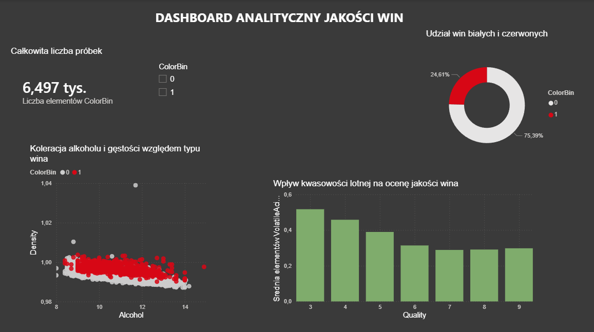

# Wine Color Classification & Analysis (End-to-End Project)

## Opis projektu

Projekt polega na klasyfikacji koloru wina (**białe / czerwone**) na podstawie jego cech fizykochemicznych z wykorzystaniem metod uczenia maszynowego. Projekt został rozbudowany o pełną architekturę danych: od procesu ETL, przez bazę danych SQL Server, aż po analitykę w Power BI.

Celem było porównanie skuteczności trzech popularnych algorytmów:
- k-Nearest Neighbors (kNN)
- Random Forest
- Support Vector Machine (SVM)

Projekt obejmuje zarówno część analityczną (trenowanie i porównanie modeli), jak i aplikację webową umożliwiającą interaktywną predykcję.

## Architektura i przepływ danych
Projekt realizuje pełny obieg danych w systemie:
1. **Źródło:** Dane z plików CSV (Wine Quality Dataset).
2. **ETL:** Skrypt Python (`etl_process.py`) czyści i ładuje dane do bazy SQL.
3. **Storage:** Relacyjna baza danych **MS SQL Server**.
4. **ML & Web:** Aplikacja Flask pobiera dane z SQL i serwuje predykcje.
5. **BI:** Power BI łączy się z bazą SQL w celu wizualizacji trendów.

## Dane

Wykorzystano zbiór danych **Wine Quality Dataset** z repozytorium UCI Machine Learning Repository.

Zbiór zawiera parametry fizykochemiczne wina, m.in.:
- VolatileAcidity
- Chlorides
- TotalSulfurDioxide
- Sulphates
- Alcohol

## Przygotowanie danych i trenowanie

W ramach procesu ML (plik `train_models.py`) wykonano:
- **Preprocessing:** Standaryzacja (StandardScaler) oraz zrównoważenie klas (SMOTE) wewnątrz potoków (Pipelines).
- **Optymalizacja:** GridSearchCV (dobór hiperparametrów) oraz walidacja krzyżowa (StratifiedKFold).
- **Baza SQL:** Modele trenowane i testowane są na danych pobieranych bezpośrednio z bazy SQL.

Porównywane modele:
- kNN
- Random Forest
- SVM

## Wyniki

Uzyskane wyniki wskazują, że klasyfikatory **Random Forest** oraz **kNN** osiągnęły najwyższą skuteczność predykcji:

Accuracy ≈ **99%**

Dodatkowo analizowano:
- macierze pomyłek
- precision, recall, f1-score

## Aplikacja webowa

Projekt zawiera aplikację webową umożliwiającą predykcję koloru wina na podstawie danych wejściowych użytkownika.

### Technologie
- **Backend:** Python (Flask, SQLAlchemy, pandas, scikit-learn)
- **Baza danych:** MS SQL Server
- **Frontend:** HTML / CSS / Jinja2
- **BI:** Power BI Desktop

### Funkcjonalności
- wprowadzanie danych przez suwaki
- predykcja koloru wina dla 3 modeli
- wizualizacja danych na wykresach (scatter plot) generowanych z bazy SQL
- macierze pomyłek dla każdego modelu
- szczegółowe statystyki modeli (classification report)

## Przykładowe zdjęcia z aplikacji
### Aplikacja webowa


### Dashboard Power BI


## Instalacja i uruchomienie
### 1. Baza Danych
Utwórz bazę `WineWarehouse` w SQL Server i uruchom skrypt SQL dostępny w dokumentacji, aby przygotować tabelę `WineData`.

### 2. Klonowanie i środowisko wirtualne
```bash
git clone [https://github.com/domido56/Wine_prediction.git](https://github.com/domido56/Wine_prediction.git)
cd Wine_prediction
python -m venv venv
venv\Scripts\activate
pip install -r requirements.txt
```
### 3. Zasilenie bazy (ETL)
Uruchom skrypt, aby przenieść dane z plików CSV do SQL Server:
```bash
python etl_process.py
```

### 4. Uruchomienie aplikacji
```bash
python app.py
```
Aplikacja będzie dostępna pod adresem: http://127.0.0.1:5000/


